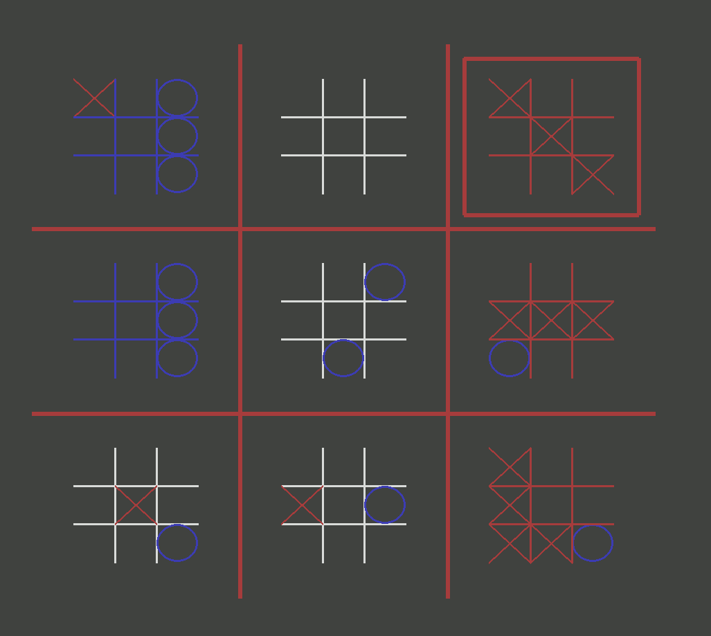

This is a Python-based [ultimate tic-tac-toe](https://en.wikipedia.org/wiki/Ultimate_tic-tac-toe) game that only requires PyGame (`pip install pygame`).

Future improvements if I come back to this side project:
* Embedding the game in a PyQt5 GUI
* Adding an AI computer player option so users can play against one another or a computer
* Setting to adjust some of the rules/behavior (what happens when a square is filled, etc...)

